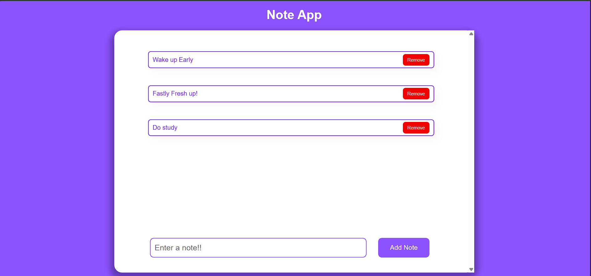

# ***notes-app***

## The Notes App is a simple web-based application designed to help users manage their tasks and notes efficiently. Built with HTML, CSS, and JavaScript, this app allows users to add, view, and delete notes with ease. It uses the browser's local storage to persist data, ensuring that the notes remain even after the page is refreshed.

### 1) User Interface (UI):

- Input Field: A text input field where users can type their notes.
- Add Button: A button to save the note into the storage.
- Note List: A list or container to display all the saved notes.
- Delete Button: A button next to each note to delete it.

### 2) Storage:

- Local Storage: Stores notes in the browser's local storage, ensuring that notes persist even after refreshing the page or closing the browser.

### 3) Functionality:

- Add Note: Allows users to add a new note. The note gets saved in local storage and displayed in the notes list.
- Delete Note: Users can remove a note. This will delete the note from both the display and local storage.
- Load Notes: On page load, the app retrieves all notes from local storage and displays them.
- Input Validation: Ensures that the note input field is not empty before adding a note.